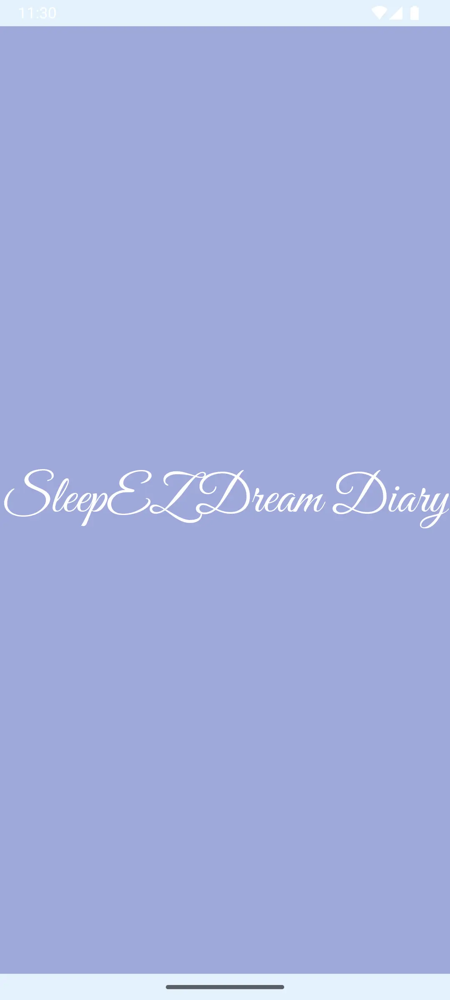
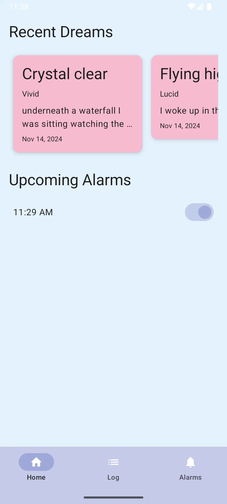

# 💤 SleepEZ Dream Diary

SleepEZ Dream Diary is a mobile app designed to help users record, categorize, and analyze their dreams. With features like search and filter, alarm scheduling, report generation, and a user-friendly interface, SleepEZ Dream Diary is perfect for tracking dream patterns and insights over time.

---

## 📑 Table of Contents

- [Features](#-features)
- [Getting Started](#-getting-started)
- [Installation](#installation)
- [Usage](#-usage)
- [Screenshots](#-screenshots)
- [Architecture](#-architecture)
- [Technologies Used](#-technologies-used)

---

## ✨ Features

- **🌈 Dream Logging**: Easily record dreams, including title, category, and content.
- **🔍 Search and Filter**: Search dreams by title, content, or category for quick access.
- **📊 Report Generation**: Generate reports for specific date ranges and export them to a chosen directory.
- **⏰ Alarm Scheduling**: Set alarms with customizable sounds to help with lucid dreaming or wake-up schedules.
- **🔒 User Authentication**: Secure account creation and login for private dream logs.
- **🌟 Modern User Interface**: A clean and intuitive UI for seamless navigation.
- **🔐 Permissions Handling**: Manages required permissions for alarms and notifications effectively.

---

## 🚀 Getting Started

### Prerequisites

- **Android Studio**: [Download and install Android Studio](https://developer.android.com/studio) (latest version recommended).
- **Android SDK**: Ensure you have the Android SDK installed (minimum SDK version 21).
- **Internet Access**: Required for dependency download and updates.

### Installation

1. **Clone the Repository**:
   ```bash
   https://gitlab.com/wgu-gitlab-environment/student-repos/ganton8/d424-software-engineering-capstone.git
   ```
2. **Open the Project**:
    - Open Android Studio and select **Open an existing Android Studio project**.
    - Navigate to the cloned directory and select it.

3. **Build and Run**:
    - Sync the project with **build.gradle**.
    - Connect an Android emulator or device.
    - Click **Run** to build and launch the app.

---

## 🎯 Usage

1. **Create or Log in to your Account**:
    - Open the app and follow the prompts to create an account or log in.

2. **Add New Dreams**:
    - Go to the **Log** screen, tap **Add Dream** to record new dreams.

3. **Set Alarms**:
    - Go to the **Alarms** screen to set and customize alarms with your preferred sounds.

4. **Search Dreams**:
    - Use the search bar on the **Log** screen to search dreams by title, content, or category.

5. **Generate Reports**:
    - Select a date range, pick a folder, and generate a detailed dream report for that period.

---

## 📸 Screenshots




---

## 🏗 Architecture

The app uses the **MVVM (Model-View-ViewModel)** architecture, leveraging Android Jetpack libraries and components to ensure scalable and maintainable code.

### Folder Structure

```plaintext
📂 SleepEZ Dream Diary
├── 📁 data              # Data models, DAOs, and database
├── 📁 ui                # UI screens and components built with Jetpack Compose
├── 📁 viewmodel         # ViewModel classes for state management
├── 📁 repository        # Repository classes for data handling
├── 📁 receiver          # Broadcast receivers for alarm scheduling
├── MainActivity.kt      # Entry point of the application
└── build.gradle         # Project dependencies and configurations
```

---

## 🛠 Technologies Used

- **Kotlin**: Main programming language.
- **Jetpack Compose**: Declarative UI framework for Android.
- **Room Database**: Local database for storing dreams and alarms.
- **Coroutines & Flow**: For asynchronous data processing.
- **ViewModel**: Manages UI-related data in a lifecycle-aware way.
- **Android Notifications**: For scheduling and displaying alarms.
- **Material Design 3**: Modern design components for a consistent UI/UX.

